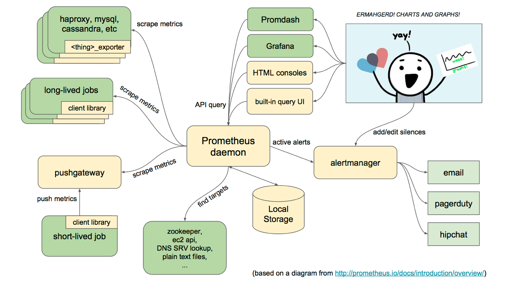

# Prometheus搭建监控报警系统
## 什么是Prometheus

# 什么是Prometheus?
Prometheus是由SoundCloud开发的开源监控报警系统和时序列数据库(TSDB)。Prometheus使用Go语言开发，是Google BorgMon监控系统的开源版本。
2016年由Google发起Linux基金会旗下的原生云基金会(Cloud Native Computing Foundation), 将Prometheus纳入其下第二大开源项目。
Prometheus目前在开源社区相当活跃。
Prometheus和Heapster(Heapster是K8S的一个子项目，用于获取集群的性能数据。)相比功能更完善、更全面。Prometheus性能也足够支撑上万台规模的集群。

# Prometheus的特点
- 多维度数据模型。
- 灵活的查询语言。
- 不依赖分布式存储，单个服务器节点是自主的。
- 通过基于HTTP的pull方式采集时序数据。
- 可以通过中间网关进行时序列数据推送。
- 通过服务发现或者静态配置来发现目标服务对象。
- 支持多种多样的图表和界面展示，比如Grafana等。

官网地址：https://prometheus.io/

# 架构图



## 基本原理
Prometheus的基本原理是通过HTTP协议周期性抓取被监控组件的状态，任意组件只要提供对应的HTTP接口就可以接入监控。不需要任何SDK或者其他的集成过程。这样做非常适合做虚拟化环境监控系统，比如VM、Docker、Kubernetes等。输出被监控组件信息的HTTP接口被叫做exporter 。目前互联网公司常用的组件大部分都有exporter可以直接使用，比如Varnish、Haproxy、Nginx、MySQL、Linux系统信息(包括磁盘、内存、CPU、网络等等)。

## 服务过程
- Prometheus Daemon负责定时去目标上抓取metrics(指标)数据，每个抓取目标需要暴露一个http服务的接口给它定时抓取。Prometheus支持通过配置文件、文本文件、Zookeeper、Consul、DNS SRV Lookup等方式指定抓取目标。Prometheus采用PULL的方式进行监控，即服务器可以直接通过目标PULL数据或者间接地通过中间网关来Push数据。
- Prometheus在本地存储抓取的所有数据，并通过一定规则进行清理和整理数据，并把得到的结果存储到新的时间序列中。
- Prometheus通过PromQL和其他API可视化地展示收集的数据。Prometheus支持很多方式的图表可视化，例如Grafana、自带的Promdash以及自身提供的模版引擎等等。Prometheus还提供HTTP API的查询方式，自定义所需要的输出。
- PushGateway支持Client主动推送metrics到PushGateway，而Prometheus只是定时去Gateway上抓取数据。
- Alertmanager是独立于Prometheus的一个组件，可以支持Prometheus的查询语句，提供十分灵活的报警方式。

## 三大套件
- Server 主要负责数据采集和存储，提供PromQL查询语言的支持。
- Alertmanager 警告管理器，用来进行报警。
- Push Gateway 支持临时性Job主动推送指标的中间网关。


## 安装准备
这里我的IP是10.211.55.25，登入，建立相应文件夹
```
mkdir -p /home/chenqionghe/promethues
mkdir -p /home/chenqionghe/promethues/server
mkdir -p /home/chenqionghe/promethues/client
```
下面开始三大套件的学习

# 1.安装Server
通过docker方式
首先创建一个配置文件/home/chenqionghe/test/prometheus/prometheus.yml
```
global:
  scrape_interval:     15s # 默认抓取间隔, 15秒向目标抓取一次数据。
  external_labels:
    monitor: 'codelab-monitor'
# 这里表示抓取对象的配置
scrape_configs:
    #这个配置是表示在这个配置内的时间序例，每一条都会自动添加上这个{job_name:"prometheus"}的标签  - job_name: 'prometheus'
    scrape_interval: 5s # 重写了全局抓取间隔时间，由15秒重写成5秒
    static_configs:
      - targets: ['localhost:9090']
```
运行
```
docker run --name=prometheus -d \
-p 9090:9090 \
-v /home/chenqionghe/promethues/server/prometheus.yml:/etc/prometheus/prometheus.yml \
prom/prometheus:v2.7.2 \
--config.file=/etc/prometheus/prometheus.yml \
--web.enable-lifecycle
```
启动时加上--web.enable-lifecycle启用远程热加载配置文件
调用指令是curl -X POST http://localhost:9090/-/reload

访问http://10.211.55.25:9090
我们会看到如下l界面

访问http://10.211.55.25:9090/metrics


我们配置了9090端口，默认prometheus会抓取自己的/metrics接口
在Graph选项已经可以看到监控的数据


# 准备Client
## 1.通过golang客户端提供metrics

```
mkdir -p /home/chenqionghe/promethues/client/golang/src
cd !$
export GOPATH=/home/chenqionghe/promethues/client/golang/
#克隆项目
git clone https://github.com/prometheus/client_golang.git
#安装需要翻墙的第三方包
mkdir -p $GOPATH/src/golang.org/x/
cd !$
git clone https://github.com/golang/net.git
git clone https://github.com/golang/sys.git
git clone https://github.com/golang/tools.git
#安装必要软件包
go get -u -v github.com/prometheus/client_golang/prometheus
#编译
cd $GOPATH/src/client_golang/examples/random
go build -o random main.go
```
运行3个示例metrics接口
```
./random -listen-address=:8080 &
./random -listen-address=:8081 &
./random -listen-address=:8082 &```
```

## 2.通过node exporter提供metrics
```
docker run -d \
--name=node-exporter \
-p 9100:9100 \
prom/node-exporter
```

然后把这两些接口再次配置到prometheus.yml, 重新载入配置curl -X POST http://localhost:9090/-/reload
```

```


